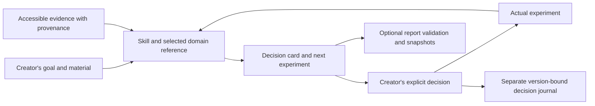

# Architecture and tradeoffs

The assistant supplies reasoning and any retrieval/media capabilities. The skill supplies the review procedure and domain references. Optional local Python supplies deterministic report checks, rendering and version persistence. None of the helper code calls a model, fetches a URL, uploads records or posts messages.

The report schema links recommendations to claims/assumptions and evidence. An experiment has a planned status separate from results. A child report retains its parent ID. A human decision is bound to the exact bytes of a report, so it is not silently inherited after edits.

Design choices:

- Short core instructions with separate domain references reduce irrelevant reading. The research harness loads all references in its text-only S condition for reproducibility; this is not identical to native lazy loading and must be reported as a limitation.
- Standard-library Python keeps installation optional and avoids dependency/API setup. It also means no semantic verifier or model service is bundled.
- New report IDs and exclusive file creation favor preservation over convenience. A local write lock serializes journal edits, and a hash chain detects ordinary alterations. Neither file permissions nor hashes provide an authenticated multi-user approval system.
- Literal quote checks catch mismatches cheaply. Human review still checks whether the quotation actually supports the proposition.
- External content remains untrusted. Prompt instructions cannot guarantee resistance to injection in every host; adversarial model tests remain necessary.

The CLI's report format is versioned separately from the alpha product. Unsupported schema versions are refused. Migration must explicitly preserve originals and explain changed fields. There is no silent network fallback when sources fail, no universal score, and no inference that an AI content label explains audience reaction.
